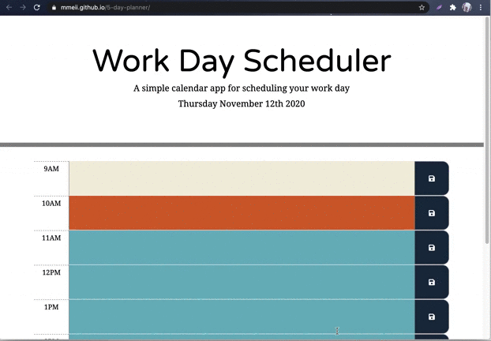

# Day Planner
This is a simple work day calendar application that allows a user to save events for each hour of the day by using the starter code provided.

## Installation
1. Download or clone repository
2. Open the main page (index.html) on your browser to view 
3. Use a text editor to view all coding, Visual Studio Coding is recommended.

## Functionality
* When the planner is openned, the current day is displayed at the top of the calendar
* When scrolled down, the user is presented with time blocks for standard business hours (from 9AM to 5PM)
* When the user views the time blocks for that day, each time block is color-coded to indicate whether it is in the past, present, or future
  *  `Past` 
  *  `Present`
  *  `Future` 
* Then the user can click into a time block and enter an event
* When clicked on the save button on the right for that time block, then the text for that event is saved in local storage
* When the page is refreshed, the saved events persist
  
## Features
* HTML
* CSS
* Bootstrap
* jQuery
* Moment.js
  
## Demo

## Websites
* Github: https://github.com/mmeii/5-day-planner
* Deployed: https://mmeii.github.io/5-day-planner/

## License
MIT
